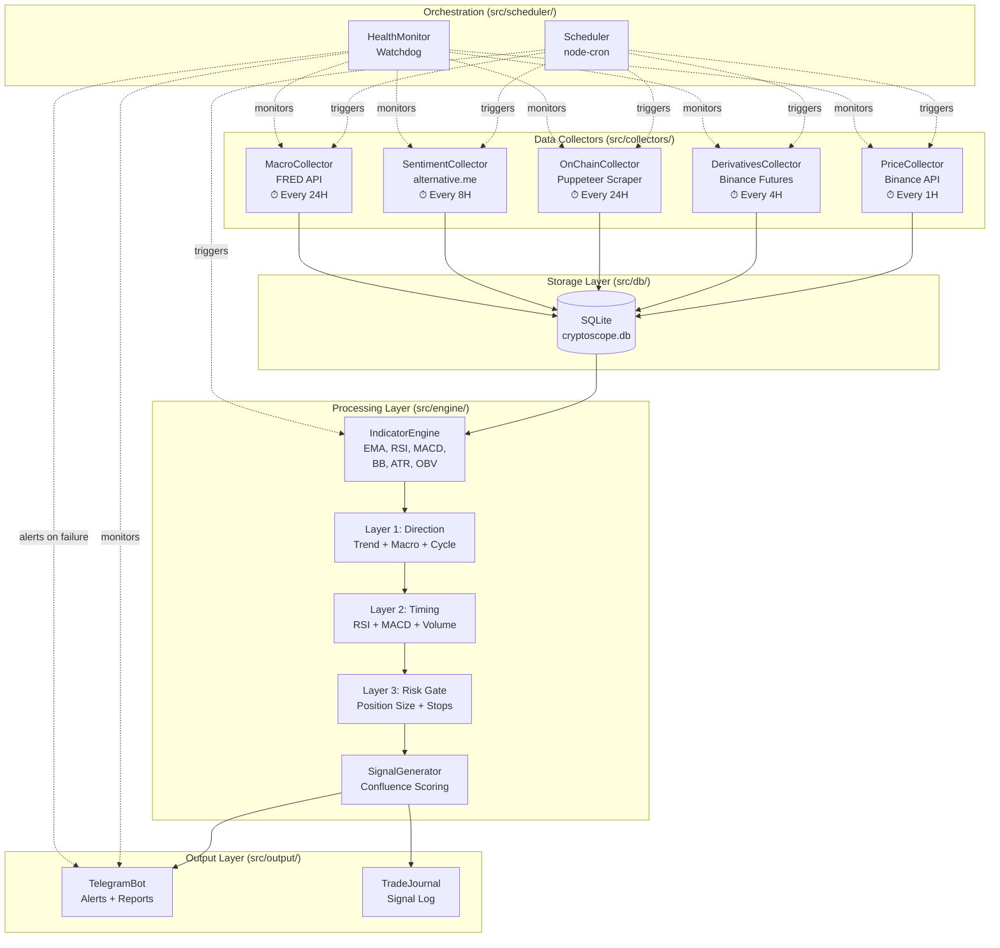
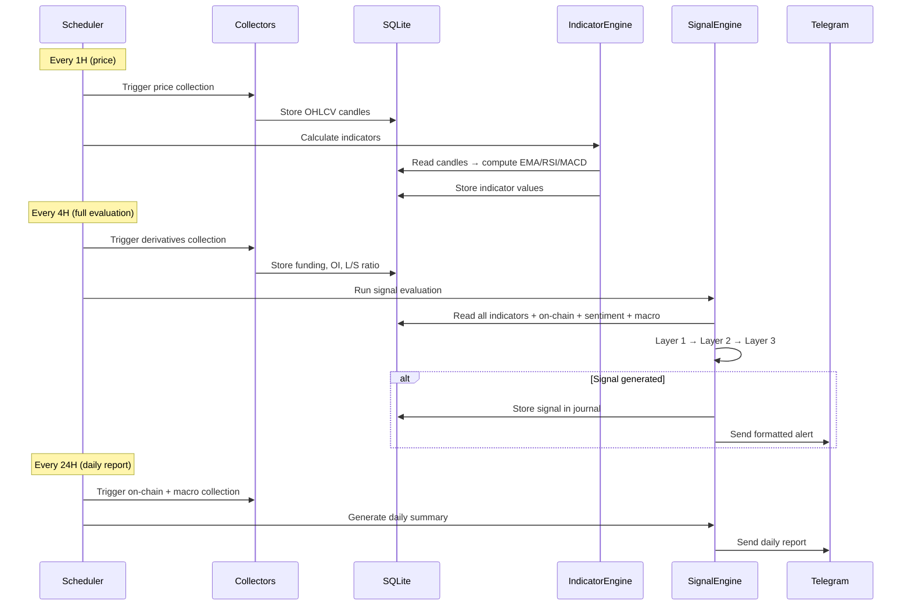

# CryptoScope — Architecture Overview & Implementation Plan

---

## 1. Technology Stack (Validated & Free)

| Component | Technology | Version | Rationale |
|-----------|-----------|---------|-----------|
| **Runtime** | Node.js + TypeScript | Node 20 LTS, TS 5.x | User has existing Node.js bot experience; strong async/await for concurrent API calls |
| **Database** | SQLite via `better-sqlite3` | Latest | Zero-config, single-file; perfect for personal service; fast reads for indicator queries |
| **Technical Indicators** | `trading-signals` | Latest | Production-tested TS library; streaming updates; covers EMA, RSI, MACD, BB, ATR |
| **HTTP Client** | `axios` | Latest | Mature, interceptors for retry logic, timeout handling |
| **Scheduler** | `node-cron` | Latest | Lightweight cron expressions; no external dependencies |
| **Telegram** | `node-telegram-bot-api` | Latest | Well-maintained; supports rich formatting, inline keyboards |
| **Web Scraping** | `puppeteer` | Latest | Required for on-chain data (Look Into Bitcoin); headless Chrome |
| **Containerization** | Docker + docker-compose | Latest | Reproducible deployment; already used by user |
| **Logging** | `pino` | Latest | Fast structured logging; log rotation via `pino-pretty` in dev |
| **Config** | `dotenv` + TypeScript config | — | `.env` for secrets, typed config module for defaults |

---

## 2. Data Sources — Validated Free APIs & Workarounds

### 2.1 Price Data (OHLCV)

| Source | Endpoint | Auth | Rate Limit | Data Available |
|--------|----------|------|-----------|----------------|
| **Binance Public API** (primary) | `GET /api/v3/klines` | ❌ No key needed | 1200 req/min (IP) | All pairs, all timeframes, full history |
| **CoinGecko Demo API** (fallback) | `GET /api/v3/coins/{id}/ohlc` | Free API key | 30 req/min | 365 days history, daily granularity |

**Binance klines endpoint details:**
```
GET https://api.binance.com/api/v3/klines
?symbol=BTCUSDT
&interval=1d        // 1m, 5m, 15m, 1h, 4h, 1d, 1w
&limit=1000         // max 1000 candles per request
&startTime=...      // unix ms (optional, for backfill)
```

Response: `[[openTime, open, high, low, close, volume, closeTime, quoteVolume, trades, takerBuyBaseVol, takerBuyQuoteVol, ignore]]`

**Backfill strategy:** Paginate by `startTime` in chunks of 1000 candles. For daily BTC data since 2020: ~2000 candles = 2 requests.

---

### 2.2 Funding Rates & Open Interest (Derivatives)

| Source | Endpoint | Auth | Data |
|--------|----------|------|------|
| **Binance Futures** | `GET /fapi/v1/fundingRate` | ❌ No key | Historical funding rates, max 1000 per request |
| **Binance Futures** | `GET /fapi/v1/openInterest` | ❌ No key | Current OI for any symbol |
| **Binance Futures** | `GET /futures/data/openInterestHist` | ❌ No key | Historical OI (30 days max) |
| **Binance Futures** | `GET /futures/data/globalLongShortAccountRatio` | ❌ No key | Long/short ratio (30 days max) |

```
GET https://fapi.binance.com/fapi/v1/fundingRate?symbol=BTCUSDT&limit=100
GET https://fapi.binance.com/fapi/v1/openInterest?symbol=BTCUSDT
```

---

### 2.3 On-Chain Data (MVRV, NUPL) — Scraping Required

> [!WARNING]
> No free API exists for MVRV/NUPL data. Look Into Bitcoin shows charts freely but requires a paid subscription for API access. **Our solution: headless browser scraping with Puppeteer.**

| Source | URL | Method | Refresh |
|--------|-----|--------|---------|
| **Look Into Bitcoin** | `https://www.lookintobitcoin.com/charts/mvrv-zscore/` | Puppeteer scrape | 1x daily |
| **Look Into Bitcoin** | `https://www.lookintobitcoin.com/charts/relative-unrealized-profit--loss/` | Puppeteer scrape | 1x daily |
| **Blockchain.com** (backup) | `https://api.blockchain.info/stats` | REST API (free) | Market cap data only |

**Scraping approach:**
1. Launch headless Puppeteer
2. Navigate to chart page
3. Wait for chart JavaScript to render (Highcharts library)
4. Extract data from the chart's internal JavaScript data series:
   ```typescript
   const data = await page.evaluate(() => {
     // Highcharts stores data in window.Highcharts.charts[0].series[0].data
     const chart = (window as any).Highcharts?.charts?.[0];
     if (!chart) return null;
     return chart.series.map((s: any) => ({
       name: s.name,
       data: s.data.map((p: any) => ({ x: p.x, y: p.y }))
     }));
   });
   ```
5. Cache the last successful scrape; only re-scrape once per 24H
6. If scrape fails, use the cached value and log a warning

**Fallback:** If scraping breaks (DOM changes), use Blockchain.com API for market cap + manual realized cap approximation calculation.

---

### 2.4 Sentiment — Fear & Greed Index

| Source | Endpoint | Auth | Rate Limit |
|--------|----------|------|-----------|
| **alternative.me** | `GET https://api.alternative.me/fng/` | ❌ No key | No stated limit (be polite: max 6 req/hour) |

```
GET https://api.alternative.me/fng/?limit=30&format=json
```

Response:
```json
{
  "data": [
    { "value": "25", "value_classification": "Extreme Fear", "timestamp": "1708646400" }
  ]
}
```

---

### 2.5 Macro Data (DXY, Interest Rates, M2)

| Source | Endpoint | Auth | Data Series |
|--------|----------|------|-------------|
| **FRED API** | `GET https://api.stlouisfed.org/fred/series/observations` | Free API key (register at fred.stlouisfed.org) | DXY → series `DTWEXBGS`, Fed Rate → `FEDFUNDS`, 10Y → `DGS10`, M2 → `M2SL` |

```
GET https://api.stlouisfed.org/fred/series/observations
?series_id=DTWEXBGS
&api_key=YOUR_FREE_KEY
&file_type=json
&observation_start=2024-01-01
&sort_order=desc
&limit=30
```

> [!NOTE]
> FRED requires a free registration to get an API key (no credit card). Data is updated daily for most series, weekly for M2.

---

## 3. Architecture

### 3.1 High-Level Architecture Diagram



### 3.2 Data Flow



---

## 4. Project Structure

```
crypto/
├── docker-compose.yml
├── Dockerfile
├── .env.example              # Template for secrets
├── .env                      # Actual secrets (gitignored)
├── package.json
├── tsconfig.json
├── README.md
├── RESEARCH_STUDY.md
├── RECOMMENDED_APPROACH.md
├── PROJECT_EPIC.md
│
├── src/
│   ├── index.ts              # Entry point: bootstrap & start scheduler
│   ├── config.ts             # Typed configuration (env vars + defaults)
│   │
│   ├── db/
│   │   ├── database.ts       # SQLite connection, migrations
│   │   ├── schema.sql        # Table definitions
│   │   └── repositories/
│   │       ├── candles.ts     # CRUD for candle data
│   │       ├── indicators.ts  # CRUD for computed indicators
│   │       ├── onchain.ts     # CRUD for on-chain metrics
│   │       ├── sentiment.ts   # CRUD for sentiment data
│   │       ├── macro.ts       # CRUD for macro data
│   │       ├── signals.ts     # CRUD for generated signals
│   │       └── journal.ts     # CRUD for trade journal entries
│   │
│   ├── collectors/
│   │   ├── base.ts           # Abstract collector with retry + error handling
│   │   ├── price.ts          # Binance OHLCV (with CoinGecko fallback)
│   │   ├── derivatives.ts    # Binance Futures: funding, OI, L/S
│   │   ├── onchain.ts        # Puppeteer scraper for MVRV/NUPL
│   │   ├── sentiment.ts      # alternative.me Fear & Greed
│   │   └── macro.ts          # FRED API: DXY, rates, M2
│   │
│   ├── engine/
│   │   ├── indicators.ts     # Indicator calculator (wraps trading-signals)
│   │   ├── layer1.ts         # Direction: EMA stack + MVRV + F&G + macro
│   │   ├── layer2.ts         # Timing: RSI pullback + MACD flip + volume
│   │   ├── layer3.ts         # Risk: position size, stop loss, take profit
│   │   ├── signal.ts         # Confluence scoring + signal generation
│   │   └── types.ts          # Signal, LayerResult, Direction enums
│   │
│   ├── output/
│   │   ├── telegram.ts       # Bot setup, message formatting, send
│   │   ├── templates.ts      # Message templates (signal, daily, alert)
│   │   └── journal.ts        # Write signal to journal DB
│   │
│   ├── scheduler/
│   │   ├── scheduler.ts      # Cron job definitions and orchestration
│   │   └── health.ts         # Monitor collector success/failure
│   │
│   └── utils/
│       ├── logger.ts         # Pino logger setup
│       ├── retry.ts          # Exponential backoff retry wrapper
│       └── math.ts           # Shared math helpers
│
├── data/
│   └── cryptoscope.db        # SQLite database file (gitignored)
│
├── scripts/
│   ├── backfill.ts           # One-time historical data backfill
│   └── backtest.ts           # Run signal engine on historical data
│
└── tests/
    ├── indicators.test.ts    # Verify indicator calculations vs known values
    ├── signal.test.ts        # Unit tests for signal engine logic
    └── collectors.test.ts    # Integration tests for API responses
```

---

## 5. Database Schema

```sql
-- Price candles from exchanges
CREATE TABLE IF NOT EXISTS candles (
    id INTEGER PRIMARY KEY AUTOINCREMENT,
    asset TEXT NOT NULL,           -- 'BTC', 'ETH'
    timeframe TEXT NOT NULL,       -- '1h', '4h', '1d'
    open_time INTEGER NOT NULL,    -- Unix timestamp ms
    open REAL NOT NULL,
    high REAL NOT NULL,
    low REAL NOT NULL,
    close REAL NOT NULL,
    volume REAL NOT NULL,
    quote_volume REAL,
    created_at TEXT DEFAULT (datetime('now')),
    UNIQUE(asset, timeframe, open_time)
);

-- Computed technical indicators
CREATE TABLE IF NOT EXISTS indicators (
    id INTEGER PRIMARY KEY AUTOINCREMENT,
    asset TEXT NOT NULL,
    timeframe TEXT NOT NULL,
    timestamp INTEGER NOT NULL,
    name TEXT NOT NULL,            -- 'ema_20', 'rsi_14', 'macd_histogram', etc.
    value REAL NOT NULL,
    created_at TEXT DEFAULT (datetime('now')),
    UNIQUE(asset, timeframe, timestamp, name)
);

-- On-chain metrics (MVRV, NUPL, etc.)
CREATE TABLE IF NOT EXISTS onchain (
    id INTEGER PRIMARY KEY AUTOINCREMENT,
    asset TEXT NOT NULL DEFAULT 'BTC',
    timestamp INTEGER NOT NULL,
    metric TEXT NOT NULL,          -- 'mvrv', 'mvrv_zscore', 'nupl'
    value REAL NOT NULL,
    source TEXT DEFAULT 'lookintobitcoin',
    created_at TEXT DEFAULT (datetime('now')),
    UNIQUE(asset, timestamp, metric)
);

-- Sentiment data
CREATE TABLE IF NOT EXISTS sentiment (
    id INTEGER PRIMARY KEY AUTOINCREMENT,
    timestamp INTEGER NOT NULL,
    metric TEXT NOT NULL,          -- 'fear_greed', 'fear_greed_classification'
    value TEXT NOT NULL,           -- Numeric or text classification
    source TEXT DEFAULT 'alternative.me',
    created_at TEXT DEFAULT (datetime('now')),
    UNIQUE(timestamp, metric)
);

-- Macro economic data
CREATE TABLE IF NOT EXISTS macro (
    id INTEGER PRIMARY KEY AUTOINCREMENT,
    timestamp INTEGER NOT NULL,
    metric TEXT NOT NULL,          -- 'dxy', 'fed_rate', 'treasury_10y', 'm2'
    value REAL NOT NULL,
    source TEXT DEFAULT 'fred',
    created_at TEXT DEFAULT (datetime('now')),
    UNIQUE(timestamp, metric)
);

-- Derivatives data
CREATE TABLE IF NOT EXISTS derivatives (
    id INTEGER PRIMARY KEY AUTOINCREMENT,
    asset TEXT NOT NULL,
    timestamp INTEGER NOT NULL,
    metric TEXT NOT NULL,          -- 'funding_rate', 'open_interest', 'long_short_ratio'
    value REAL NOT NULL,
    source TEXT DEFAULT 'binance',
    created_at TEXT DEFAULT (datetime('now')),
    UNIQUE(asset, timestamp, metric)
);

-- Generated signals
CREATE TABLE IF NOT EXISTS signals (
    id INTEGER PRIMARY KEY AUTOINCREMENT,
    asset TEXT NOT NULL,
    timestamp INTEGER NOT NULL,
    direction TEXT NOT NULL,       -- 'BUY', 'SELL', 'NO_TRADE'
    composite_score REAL,
    layer1_direction TEXT,         -- 'BULLISH', 'BEARISH', 'NEUTRAL'
    layer1_score REAL,
    layer2_timing TEXT,            -- 'ENTRY', 'EXIT', 'NO_SIGNAL'
    layer2_details TEXT,           -- JSON with individual indicator readings
    entry_zone_low REAL,
    entry_zone_high REAL,
    stop_loss REAL,
    take_profit_1 REAL,
    take_profit_2 REAL,
    position_size_pct REAL,
    rationale TEXT,                -- Human-readable explanation
    status TEXT DEFAULT 'ACTIVE',  -- 'ACTIVE', 'EXECUTED', 'EXPIRED', 'CANCELLED'
    created_at TEXT DEFAULT (datetime('now'))
);

-- Trade journal (manual tracking after executing signals)
CREATE TABLE IF NOT EXISTS trade_journal (
    id INTEGER PRIMARY KEY AUTOINCREMENT,
    signal_id INTEGER REFERENCES signals(id),
    entry_time INTEGER,
    exit_time INTEGER,
    entry_price REAL,
    exit_price REAL,
    position_size REAL,
    pnl_eur REAL,
    pnl_pct REAL,
    notes TEXT,
    created_at TEXT DEFAULT (datetime('now'))
);

-- Create indexes for common queries
CREATE INDEX IF NOT EXISTS idx_candles_lookup ON candles(asset, timeframe, open_time);
CREATE INDEX IF NOT EXISTS idx_indicators_lookup ON indicators(asset, timeframe, timestamp);
CREATE INDEX IF NOT EXISTS idx_signals_active ON signals(status, asset);
```

---

## 6. Scheduler Design

| Job | Cron Expression | What It Does |
|-----|----------------|-------------|
| `price-collect` | `0 * * * *` (every hour) | Fetch latest 1H/4H/Daily candles for BTC + ETH |
| `indicators-calc` | `5 * * * *` (hour + 5 min) | Recalculate all technical indicators from candle data |
| `derivatives-collect` | `0 */4 * * *` (every 4H) | Fetch funding rates, OI, long/short ratio |
| `sentiment-collect` | `0 */8 * * *` (every 8H) | Fetch Fear & Greed Index |
| `onchain-collect` | `0 6 * * *` (6 AM daily) | Scrape MVRV/NUPL from Look Into Bitcoin |
| `macro-collect` | `0 7 * * *` (7 AM daily) | Fetch DXY, rates, M2 from FRED |
| `signal-evaluate` | `10 */4 * * *` (every 4H + 10 min) | Run 3-layer signal engine, generate alerts |
| `daily-report` | `0 8 * * *` (8 AM daily) | Generate and send daily market summary |
| `health-check` | `*/15 * * * *` (every 15 min) | Verify data freshness, alert on stale data |

---

## 7. Implementation Phases

### Phase 1: Scaffold + Data Pipeline (Stage 1)

**Files to create:**
- `package.json`, `tsconfig.json`, `Dockerfile`, `docker-compose.yml`, `.env.example`
- `src/index.ts`, `src/config.ts`
- `src/utils/logger.ts`, `src/utils/retry.ts`
- `src/db/database.ts`, `src/db/schema.sql`
- `src/db/repositories/candles.ts`
- `src/collectors/base.ts`, `src/collectors/price.ts`
- `src/scheduler/scheduler.ts`

**Milestone:** `docker-compose up` starts the service, fetches BTC/ETH candles every hour, stores in SQLite.

---

### Phase 2: All Data Collectors (Stage 1 continued)

**Files to create:**
- `src/collectors/derivatives.ts` — Binance Futures funding/OI
- `src/collectors/sentiment.ts` — alternative.me Fear & Greed
- `src/collectors/onchain.ts` — Puppeteer scraper for Look Into Bitcoin
- `src/collectors/macro.ts` — FRED API client
- `src/db/repositories/` — remaining repos (onchain, sentiment, macro, derivatives)
- `scripts/backfill.ts` — historical data loader

**Milestone:** All 5 data sources populating. Historical backfill for ≥6 months. `health-check` reports all sources GREEN.

---

### Phase 3: Indicator Engine (Stage 2)

**Files to create:**
- `src/engine/indicators.ts` — wraps `trading-signals` library
- `src/engine/types.ts` — TypeScript types and enums
- `src/db/repositories/indicators.ts`
- `tests/indicators.test.ts`

**Indicators to implement:** EMA(20/50/200), RSI(14), MACD(12,26,9), Bollinger Bands(20,2), ATR(14), OBV

**Milestone:** All indicators computed and stored. Values verified against TradingView within tolerance.

---

### Phase 4: Signal Engine (Stage 3)

**Files to create:**
- `src/engine/layer1.ts`, `src/engine/layer2.ts`, `src/engine/layer3.ts`
- `src/engine/signal.ts`
- `src/db/repositories/signals.ts`, `src/db/repositories/journal.ts`
- `tests/signal.test.ts`

**Milestone:** Signal engine generating scored signals with position sizing. At least 3 days of live signal generation reviewed manually.

---

### Phase 5: Telegram Output (Stage 4)

**Files to create:**
- `src/output/telegram.ts`
- `src/output/templates.ts`
- `src/output/journal.ts`
- `src/scheduler/health.ts`

**Milestone:** Telegram bot sends signal alerts, daily reports, and health notifications. Messages readable on mobile.

---

### Phase 6: Validation & Hardening (Stage 5)

**Files to create/modify:**
- `scripts/backtest.ts` — run signal engine on historical data
- `tests/collectors.test.ts`
- Error handling hardening across all files
- Docker health checks + auto-restart

**Milestone:** Backtest results reviewed. Paper trading mode active. System runs unattended for 7+ days.

---

## 8. Key Dependencies (`package.json`)

```json
{
  "dependencies": {
    "axios": "^1.7.0",
    "better-sqlite3": "^11.0.0",
    "dotenv": "^16.4.0",
    "node-cron": "^3.0.0",
    "node-telegram-bot-api": "^0.66.0",
    "pino": "^9.0.0",
    "puppeteer": "^23.0.0",
    "trading-signals": "^4.0.0"
  },
  "devDependencies": {
    "@types/better-sqlite3": "^7.6.0",
    "@types/node": "^20.0.0",
    "@types/node-cron": "^3.0.0",
    "@types/node-telegram-bot-api": "^0.64.0",
    "pino-pretty": "^11.0.0",
    "tsx": "^4.0.0",
    "typescript": "^5.5.0",
    "vitest": "^2.0.0"
  }
}
```

---

## 9. Environment Variables (`.env.example`)

```env
# Telegram
TELEGRAM_BOT_TOKEN=           # From @BotFather
TELEGRAM_CHAT_ID=             # Your personal chat ID

# FRED API (free registration: https://fred.stlouisfed.org/docs/api/api_key.html)
FRED_API_KEY=

# Trading config
PORTFOLIO_VALUE_EUR=2000
RISK_PER_TRADE_PCT=2
MAX_POSITIONS=3
MAX_PORTFOLIO_RISK_PCT=6

# Assets to track
ASSETS=BTC,ETH

# Schedule (defaults, can be overridden)
PRICE_CRON=0 * * * *
SIGNAL_CRON=10 */4 * * *
DAILY_REPORT_CRON=0 8 * * *

# Database
DB_PATH=./data/cryptoscope.db

# Logging
LOG_LEVEL=info
```

---

## 10. Verification Plan

### Automated Tests
```bash
# Run all unit tests
npm test

# Specific test suites
npx vitest run tests/indicators.test.ts   # Verify indicator math
npx vitest run tests/signal.test.ts       # Verify signal logic
npx vitest run tests/collectors.test.ts   # Verify API parsing
```

### Integration Verification
```bash
# 1. Start the service
docker-compose up -d

# 2. Check logs for successful data collection
docker-compose logs -f --tail=50

# 3. Query database to verify data is populated
sqlite3 data/cryptoscope.db "SELECT COUNT(*) FROM candles;"
sqlite3 data/cryptoscope.db "SELECT * FROM candles ORDER BY open_time DESC LIMIT 5;"
sqlite3 data/cryptoscope.db "SELECT * FROM indicators ORDER BY timestamp DESC LIMIT 10;"
sqlite3 data/cryptoscope.db "SELECT * FROM signals ORDER BY timestamp DESC LIMIT 5;"
```

### Manual Verification
- Compare indicator values (EMA, RSI, MACD) against TradingView charts — should match within 0.5%
- Verify Telegram messages arrive on phone with correct formatting
- Let the system run for 24H and confirm all scheduled jobs executed (check logs)
- Manually trigger a backfill and verify historical data populates correctly
