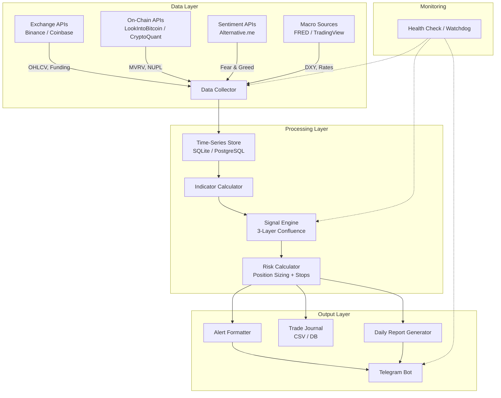
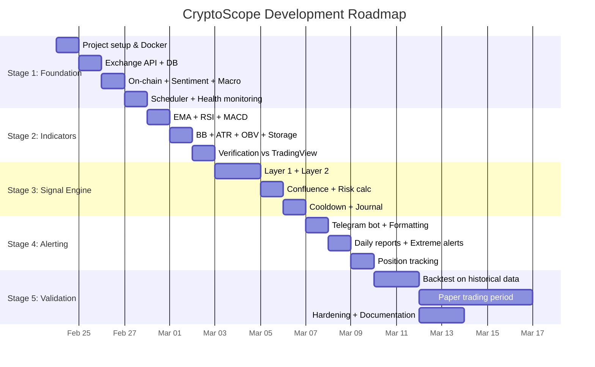

# EPIC: CryptoScope — Personal Crypto Trading Decision Support Service

---

## Project Overview

| Field | Detail |
|-------|--------|
| **Project Name** | CryptoScope |
| **Type** | Personal trading decision support service |
| **Owner** | Andrey (sole user, operator, and stakeholder) |
| **Trading Capital** | €2,000 starting budget |
| **Target Assets** | BTC, ETH (expandable to 1-2 high-cap alts later) |
| **Trading Style** | Mid-term swing/position trading (days to weeks) |
| **Goal** | Systematically grow capital via data-driven signals with strict risk management |
| **Status** | Research complete → Ready for implementation |

### Vision Statement

Build a lightweight, self-hosted service that continuously monitors the crypto market across multiple data layers (price, on-chain, sentiment, macro), generates confluence-based buy/sell signals with risk parameters, and delivers actionable alerts — replacing emotional decision-making with a disciplined, evidence-backed process.

### What This Is NOT

- ❌ A fully automated trading bot (human makes final decisions)
- ❌ A high-frequency or day-trading system
- ❌ A SaaS product for other users
- ❌ A guaranteed profit machine

---

## Requirements

### Functional Requirements

#### FR1: Data Collection

| ID | Requirement | Priority | Details |
|----|------------|----------|---------|
| FR1.1 | Collect OHLCV price data for BTC and ETH | **Must** | From exchange API (Binance/Coinbase). Candles: 1H, 4H, Daily. |
| FR1.2 | Calculate technical indicators from price data | **Must** | EMA(20/50/200), RSI(14), MACD(12,26,9), Bollinger Bands(20,2), ATR(14), OBV |
| FR1.3 | Fetch on-chain metrics | **Must** | MVRV Ratio, NUPL at minimum. Source: free API or scraping Look Into Bitcoin |
| FR1.4 | Fetch Fear & Greed Index | **Must** | Source: alternative.me API (free, public) |
| FR1.5 | Fetch funding rates | **Should** | Source: Binance/Bybit API (free) |
| FR1.6 | Fetch DXY and macro context | **Should** | Source: TradingView widget scraping or FRED API |
| FR1.7 | Fetch open interest and long/short ratios | **Could** | Source: Coinglass API or exchange APIs |
| FR1.8 | Store historical data locally | **Must** | Append-only time-series storage for all collected metrics |

#### FR2: Signal Engine

| ID | Requirement | Priority | Details |
|----|------------|----------|---------|
| FR2.1 | Implement Layer 1 — Direction assessment | **Must** | Price vs EMA50/200, MVRV zone, Fear & Greed level → Bullish / Bearish / Neutral |
| FR2.2 | Implement Layer 2 — Timing signals | **Must** | RSI pullback detection, MACD histogram reversal, volume confirmation |
| FR2.3 | Implement Layer 3 — Risk gate | **Must** | Calculate position size, stop-loss level (ATR-based), take-profit targets |
| FR2.4 | Confluence scoring | **Must** | Require minimum 3/4 Layer 1 checks to agree before allowing Layer 2 signals |
| FR2.5 | No-trade zone detection | **Must** | When confluence is mixed (neither bullish nor bearish), output "NO TRADE — CASH" |
| FR2.6 | Signal cooldown | **Should** | After a signal fires, require confirmation candle close before alerting |
| FR2.7 | Track open positions | **Should** | Monitor active trades, check stop/TP levels, alert on exit triggers |

#### FR3: Alerting & Reporting

| ID | Requirement | Priority | Details |
|----|------------|----------|---------|
| FR3.1 | Send alerts via Telegram | **Must** | Formatted messages with signal type, asset, direction, entry zone, stop, TP, rationale |
| FR3.2 | Daily market summary report | **Must** | Sent once per day: regime status, indicator readings across all layers, any pending signals |
| FR3.3 | Urgent alerts for extreme conditions | **Should** | Immediate alert when: MVRV hits extremes, flash crash >10%, F&G hits <10 or >90 |
| FR3.4 | Weekly performance summary | **Could** | Track signal accuracy, open P&L, win rate, average R/R |

#### FR4: Backtesting & Validation

| ID | Requirement | Priority | Details |
|----|------------|----------|---------|
| FR4.1 | Backtest signal engine on historical data | **Should** | Minimum 2 years BTC/ETH history; compute win rate, Sharpe, max drawdown |
| FR4.2 | Paper trading mode | **Should** | Log signals as if executed (virtual portfolio) without real trades |
| FR4.3 | Signal journal / trade log | **Must** | Persistent log of every signal generated: timestamp, asset, direction, score, outcome |

---

### Non-Functional Requirements

| ID | Requirement | Target |
|----|------------|--------|
| NFR1 | **Reliability** | Service runs 24/7 with <1% downtime. Auto-restart on failure. |
| NFR2 | **Data freshness** | Price data ≤5 min stale; indicators recalculated every 1-4H; on-chain/sentiment daily |
| NFR3 | **Latency** | Alert delivery within 60 seconds of signal generation |
| NFR4 | **Cost** | Zero ongoing infrastructure cost (self-hosted on existing hardware or free-tier cloud) |
| NFR5 | **Maintainability** | Clean, modular code. Adding a new indicator should take <1 hour |
| NFR6 | **Data integrity** | No duplicate entries; graceful handling of API failures; data gaps logged |
| NFR7 | **Security** | API keys stored in environment variables, not in code. No exchange trading permissions needed. |
| NFR8 | **Portability** | Dockerized deployment. Runs on Mac, Linux, or any VPS |

---

## Technical Specifications

### Architecture



### Technology Stack

| Component | Technology | Rationale |
|-----------|-----------|-----------|
| Runtime | Node.js (TypeScript) or Python | User familiarity; rich crypto library ecosystem |
| Database | SQLite (start) → PostgreSQL (scale) | Zero-config start; upgrade path exists |
| Scheduler | Node-cron / APScheduler | Trigger data collection and signal evaluation on schedule |
| Telegram | Telegram Bot API (node-telegram-bot-api / python-telegram-bot) | Free, instant, rich formatting, works on mobile |
| Containerization | Docker + docker-compose | Reproducible deployment; already used by user |
| Hosting | Existing VPS or Mac mini | €0 additional cost |

### Data Schema (Core Tables)

```
candles:        timestamp, asset, timeframe, open, high, low, close, volume
indicators:     timestamp, asset, timeframe, indicator_name, value
onchain:        timestamp, asset, metric_name, value
sentiment:      timestamp, metric_name, value
macro:          timestamp, metric_name, value
signals:        timestamp, asset, direction, composite_score, layer1_score, layer2_score, 
                entry_zone, stop_loss, take_profit, position_size_pct, rationale, status
trade_journal:  signal_id, entry_time, exit_time, entry_price, exit_price, pnl, notes
```

### Alert Message Format (Telegram)

```
🟢 BUY SIGNAL — BTC/USDT

📊 Composite Score: +0.68 (Strong Buy)

Layer 1 — Direction: ✅ BULLISH
  • Price > EMA50 > EMA200 ✅
  • MVRV: 1.74 (healthy) ✅
  • Fear & Greed: 32 (Fear) ✅
  • DXY: Declining ✅

Layer 2 — Timing: ✅ ENTRY
  • RSI(14): 38.2 (pullback zone) ✅
  • MACD: Histogram turning positive ✅
  • Volume: 1.3× average ✅

Layer 3 — Risk:
  • Entry zone: €54,200 – €54,800
  • Stop loss: €52,100 (2× ATR)
  • Target 1: €57,400 (2:1 R/R) → exit 50%
  • Target 2: trail with EMA20
  • Position size: €1,080 (2% risk = €40)

⏱ Signal generated: 2026-02-12 16:00 UTC
```

---

## Delivery Stages

### Stage 1: Foundation — Data Pipeline
**Duration:** 3-4 days · **Deliverable:** Working data collection + storage

| Task | Details | Acceptance Criteria |
|------|---------|-------------------|
| 1.1 Set up project structure | Docker, config, env vars, folder layout | `docker-compose up` starts clean |
| 1.2 Exchange API integration | Binance API for BTC/ETH OHLCV (1H, 4H, Daily) | Candles fetched and stored every hour |
| 1.3 Database setup | SQLite schema, migration system | All core tables created; historical backfill works |
| 1.4 On-chain data fetching | MVRV, NUPL from free sources | Daily values stored correctly |
| 1.5 Sentiment data fetching | Fear & Greed from alternative.me | Current value fetched every 4-8H |
| 1.6 Macro data fetching | DXY value (basic) | Daily DXY stored |
| 1.7 Scheduler | Cron jobs for all data fetches | All fetches run on schedule; failures logged, retried |
| 1.8 Health monitoring | Basic watchdog + error alerting | Sends Telegram message on fetch failure |

**Exit gate:** All data sources populating reliably for 24+ hours. Historical backfill complete (≥6 months).

---

### Stage 2: Indicator Engine
**Duration:** 2-3 days · **Deliverable:** All technical indicators calculated and stored

| Task | Details | Acceptance Criteria |
|------|---------|-------------------|
| 2.1 EMA calculation | EMA(20), EMA(50), EMA(200) for each asset + timeframe | Values match TradingView within 0.1% |
| 2.2 RSI calculation | RSI(14) | Values match TradingView within 0.5 points |
| 2.3 MACD calculation | MACD line, signal line, histogram | Values match TradingView |
| 2.4 Bollinger Bands | BB(20,2) | Upper, middle, lower bands calculated |
| 2.5 ATR calculation | ATR(14) | Used for position sizing and stop placement |
| 2.6 OBV calculation | On-Balance Volume | Running OBV calculated correctly |
| 2.7 Indicator storage | All indicators persisted per evaluation cycle | Queryable history for backtesting |

**Exit gate:** All indicators verified against TradingView charts. Indicator history building for 48+ hours.

---

### Stage 3: Signal Engine + Risk Calculator
**Duration:** 3-4 days · **Deliverable:** Complete 3-layer signal system generating scored signals

| Task | Details | Acceptance Criteria |
|------|---------|-------------------|
| 3.1 Layer 1 implementation | Direction assessment (EMA stack + MVRV + F&G + DXY) | Returns BULLISH / BEARISH / NEUTRAL with score |
| 3.2 Layer 2 implementation | Timing (RSI zone + MACD flip + volume check) | Returns ENTRY / EXIT / NO SIGNAL |
| 3.3 Confluence logic | Minimum 3/4 Layer 1 agreement required | Mixed signals → NO TRADE output |
| 3.4 Risk calculator | Position size, stop loss, take profit levels | Math verified against manual calculations |
| 3.5 Signal cooldown | Wait for confirmation candle close | Prevents acting on intra-candle noise |
| 3.6 No-trade zone | Detect choppy/uncertain conditions | System stays quiet when confidence is low |
| 3.7 Signal persistence | Store all signals in journal | Complete audit trail of every signal |

**Exit gate:** System generates realistic signals on live data for 3+ days. Manual review confirms signals make sense.

---

### Stage 4: Alerting & Reporting
**Duration:** 2-3 days · **Deliverable:** Telegram bot delivering formatted alerts and daily reports

| Task | Details | Acceptance Criteria |
|------|---------|-------------------|
| 4.1 Telegram bot setup | Create bot, configure chat, test connectivity | Messages received on phone |
| 4.2 Signal alert formatting | Rich formatted messages (see template above) | All fields populated; readable on mobile |
| 4.3 Daily summary report | Market regime, all indicator readings, pending signals | Delivered once daily at configured time |
| 4.4 Extreme condition alerts | Immediate alert when: MVRV hits extremes, flash crash >10%, F&G hits <10 or >90 | Triggers within 60 seconds of detection |
| 4.5 Open position tracking | Monitor active trades vs stop/TP levels | Alert when stop or TP hit |
| 4.6 Error/health notifications | Service down, API failures, data gaps | Operator knows immediately when something breaks |

**Exit gate:** Full alert flow working end-to-end. Signals arrive on phone correctly formatted. Daily reports delivered.

---

### Stage 5: Validation & Hardening
**Duration:** 3-5 days · **Deliverable:** Tested, hardened system ready for live use

| Task | Details | Acceptance Criteria |
|------|---------|-------------------|
| 5.1 Historical backtest | Run signal engine on 1-2 years of data | Win rate, Sharpe, max drawdown computed and reviewed |
| 5.2 Paper trading mode | Virtual portfolio tracking signals | 2-week paper trading period with logged results |
| 5.3 Edge case handling | API downtime, malformed data, rate limits, gaps | System degrades gracefully; no crashes |
| 5.4 Performance review | Analyze backtest + paper results | Positive expectancy verified before going live |
| 5.5 Configuration tuning | Adjust thresholds based on backtest findings | Document final parameter choices and rationale |
| 5.6 Deployment hardening | Auto-restart, log rotation, resource limits | Survives server reboot; no memory leaks over 7 days |
| 5.7 Documentation | README, configuration guide, runbook | Another person could maintain the system |

**Exit gate:** System is backtested across ≥1 full market cycle. Paper trading shows positive or neutral results. System runs unattended for 7+ days without issues.

---

## Estimated Timeline



**Total estimated effort:** 14-19 working days (excluding paper trading observation period)

---

## Risk Register

| Risk | Impact | Likelihood | Mitigation |
|------|--------|-----------|------------|
| Free API rate limits or deprecation | Data gaps → missed signals | Medium | Use multiple backup sources; cache aggressively; implement graceful degradation |
| On-chain data source goes paid-only | Lose MVRV/NUPL layer | Low | Multiple free sources exist (Look Into Bitcoin, CryptoQuant free tier); can scrape as fallback |
| Overfitting signal parameters | False sense of security → losses | Medium | Use simple parameters (standard RSI-14, EMA-50/200); validate out-of-sample; resist over-optimization |
| System downtime during critical market move | Missed signal | Low | Docker auto-restart; health check alerts; manual TradingView alerts as backup |
| Emotional override of system signals | Undisciplined trading despite system | High | Paper trade first; log every deviation; review weekly; pre-commit to following signals for fixed periods |
| Correlation blow-up | BTC + ETH drop simultaneously | Medium | Max 6% total portfolio risk; accept this is inherent to crypto; keep 30-50% in stablecoins/cash |

---

## Success Metrics (KPIs)

### System Metrics (Measure the tool)
| Metric | Target | Measurement |
|--------|--------|-------------|
| Uptime | > 99% | Automated health check logs |
| Data freshness | Price < 5 min stale, on-chain < 24H | Timestamp comparison |
| Alert latency | < 60 seconds | Signal timestamp vs delivery timestamp |
| False signal rate | < 40% | Signal journal: signals that hit stop loss |

### Trading Metrics (Measure the outcomes)
| Metric | Target (Year 1) | Measurement |
|--------|-----------------|-------------|
| Win rate | > 40% | Trade journal |
| Average reward/risk | > 1.5:1 | Trade journal |
| Max drawdown | < 25% of portfolio | Portfolio tracking |
| Sharpe ratio | > 0.5 (annualized) | Monthly calculation |
| Largest single loss | < 3% of portfolio | Trade journal |
| Signal compliance | > 90% (following system rules) | Self-audit log |

---

## Out of Scope (v1)

- Automated trade execution (manual execution only)
- Mobile app or web dashboard
- Multi-exchange arbitrage
- Altcoin screening beyond BTC/ETH
- Machine learning / AI-based signal generation
- Social media sentiment scraping
- Portfolio rebalancing automation
- Tax reporting integration

---

## Definition of Done

The project is **done** when:

1. ✅ All 5 stages pass their exit gates
2. ✅ System runs unattended for 7+ consecutive days without crashes
3. ✅ At least 10 signals generated and manually reviewed for quality
4. ✅ Backtest shows positive expectancy across ≥1 year of historical data
5. ✅ Paper trading period (2 weeks) completed with logged results
6. ✅ Operator (Andrey) is confident enough to begin Phase 2 (live trading with full €2k)
