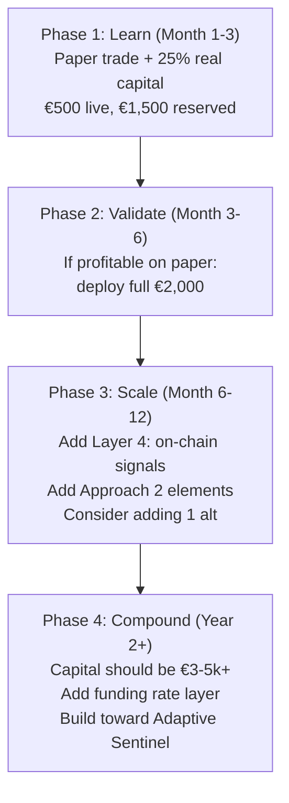

# Best Approach for Your Situation
## €2,000 Budget · Mid-Term Trading · Personal Use

---

## Honest Math First

Before choosing an approach, let's set realistic expectations:

| Scenario | Annual Return | €2,000 Becomes | Monthly Avg |
|----------|--------------|-----------------|-------------|
| Good systematic trader | 30-60% / year | €2,600 – €3,200 | ~€50-100 |
| Great year (strong bull) | 100-200% | €4,000 – €6,000 | ~€170-330 |
| Bad year (bear/chop) | -10% to -30% | €1,400 – €1,800 | Loss |
| Buy-and-hold BTC in bull cycle | 50-150% | €3,000 – €5,000 | Passive |

> [!IMPORTANT]
> With €2k, no approach will generate life-changing income in the short term. The real goal should be: **grow the capital while learning the craft**. The skills and system you build now become extremely valuable when you later scale to €10k–€50k.

---

## Why Approach 3 (Contrarian Compass) Is Not Right For You

Despite being the most "robust" in theory, the pure DCA/cycle approach is a poor fit here:

- **Too slow** — Weekly/monthly signals with DCA means you'd deploy €2k over months with minimal active management
- **Low absolute returns** — Even a perfect cycle call (+100%) takes 6-12 months and gives you €2k profit. Meanwhile you had no engagement or learning
- **Not enough capital to benefit from systematic DCA** — DCA works when you have ongoing income to deploy; with a fixed €2k, you need to be more tactical

## Why Approach 2 (Adaptive Sentinel) Is Wrong Too

- **Over-engineered for €2k** — Building statistical z-score calibration, regime-relative scoring, and self-adjusting weights is a massive effort for a small account
- **Requires extensive historical data** to calibrate properly
- **Diminishing returns** — The marginal accuracy gain over simpler rules doesn't justify the complexity at this scale

---

## ✅ Recommended: Modified Approach 1 (Dashboard Oracle) — Simplified

**The rule-based multi-layer system is your best fit**, but stripped down to essentials for your budget and situation.

### Why This Works for €2k

| Factor | Fit |
|--------|-----|
| **Transparency** | You understand every signal — critical when learning |
| **Low maintenance** | Check once per day (15-20 min), act maybe 2-4 times per month |
| **Capital-efficient** | Focus on 2-3 assets max, meaningful positions |
| **Buildable iteratively** | Start simple, add layers as you learn what works |
| **Low false positive risk** | Confluence requirement prevents impulsive trades |

### Your Simplified System Design

**Assets to trade:** BTC and ETH only (possibly 1 high-cap alt like SOL)

> [!WARNING]
> With €2k, do NOT spread across 10+ altcoins. Fees, spreads, and small positions will eat you alive. Focus on 2-3 liquid assets where slippage is minimal.

---

### Three-Layer Signal Model (Simplified from the 6-layer research model)

You don't need all 6 layers at this scale. Start with 3:

#### Layer 1 — Direction (Macro + Trend)
*"Should I be buying or selling at all right now?"*

| Check | Bullish | Bearish |
|-------|---------|---------|
| BTC vs. 50-day EMA | Price above | Price below |
| BTC vs. 200-day EMA | Price above | Price below |
| MVRV Ratio | < 2.5 | > 3.0 |
| Fear & Greed | < 60 | > 80 |

**Rule:** At least 3 of 4 must agree to trade in that direction. If mixed → **no trade, cash**.

#### Layer 2 — Timing (Momentum)
*"Is this a good time to enter?"*

| Check | Buy Signal | Sell Signal |
|-------|-----------|-------------|
| RSI (14, daily) | 30-45 range (pulling back in uptrend) | > 75 (overbought) |
| MACD histogram | Turning from negative to positive | Turning from positive to negative |
| Volume | Above 20-day average | Drying up on rally |

**Rule:** Wait for RSI pullback + MACD confirmation before entering. Don't chase green candles.

#### Layer 3 — Risk Gate
*"How much should I risk?"*

| Parameter | Rule |
|-----------|------|
| Risk per trade | **2% of portfolio = €40** (stop loss distance determines position size) |
| Max positions | 2-3 at any time |
| Max portfolio risk | 6% total across all positions |
| Stop loss | 2× ATR(14) below entry, or below recent swing low |
| Take profit | Scale out: 50% at 2:1 R/R, trail rest with EMA20 |

**Position size formula:**
```
Position = €40 / (Entry Price − Stop Price) × Entry Price

Example: BTC at €55,000, stop at €53,000 (€2,000 gap)
Position = €40 / €2,000 × €55,000 = €1,100 in BTC
Risk = €40 = exactly 2% of your €2,000
```

---

### Daily Routine (15-20 minutes)

| Time | Action |
|------|--------|
| **Morning** | Check daily candle close. Update Layer 1 checklist. Check if any Layer 2 entry signals triggered. Review open positions vs. stops. |
| **Weekly** | Check MVRV (Look Into Bitcoin, free), Fear & Greed, macro context (is DXY trending?). Write 2-sentence market note. |
| **Monthly** | Review trades. Win rate? Average R/R? What worked, what didn't? Adjust rules if needed. |

### Where to Get Data (Free)

| Data | Source |
|------|--------|
| Price, EMA, RSI, MACD, Bollinger | **TradingView** (free tier, set alerts) |
| MVRV, NUPL | **Look Into Bitcoin** (free, no login) |
| Fear & Greed | **alternative.me** (free API) |
| Funding rates | **Coinglass.com** (free) |
| DXY, macro | **TradingView** (free) |

---

### Growth Path



> [!CAUTION]
> **Phase 1 is non-negotiable.** Do NOT deploy all €2k on day one. Paper-trade for at least 30 signals to verify your system has positive expectancy before going fully live. The single biggest mistake small-account traders make is skipping validation.

---

### What Success Looks Like After Year 1

| Metric | Good | Excellent |
|--------|------|-----------|
| Win rate | 40-50% | 50-60% |
| Average R/R | 1.5:1 | 2:1+ |
| Max drawdown | < 20% | < 15% |
| Number of trades | 30-50 | 30-50 |
| Portfolio growth | 20-40% | 50-100%+ |
| Biggest single loss | < 3% of portfolio | < 2% |

**The real win:** After 12 months, you've developed a tested, personalized system and the discipline to run it — which is worth far more than the €2k itself once you scale up.
