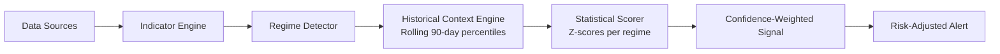
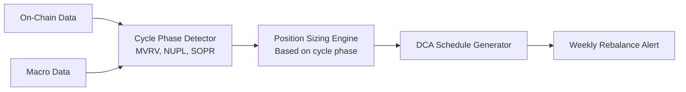

# Personal Crypto Trading Decision Support Service
## Deep Research Study & Conceptual Design

---

## 1. Market Reality Check

### What Actually Works in Mid-Term Crypto Analysis

Based on research across academic papers, professional trading blogs, quantitative trading communities, and industry publications, the following findings emerge for mid-term (days-to-weeks/months) crypto trading:

**What has empirical support:**

| Approach | Evidence Level | Key Insight |
|----------|---------------|-------------|
| Trend-following (MA crossovers) | Strong | Works well in crypto due to persistent momentum effects; 50/200-day MA crossovers ("Golden/Death Cross") remain statistically meaningful |
| Multi-timeframe confirmation | Strong | Signals validated on 4H + Daily charts significantly outperform single-timeframe analysis |
| On-chain cycle analysis (MVRV, NUPL) | Moderate-Strong | Effective at identifying macro cycle tops/bottoms; Glassnode and academic research show MVRV historically identifies accumulation/distribution zones |
| Sentiment as contrarian signal | Moderate | Research (RePEc) suggests contrarian strategies based on Fear & Greed Index outperform passive investment, indicating market inefficiency |
| Macro liquidity correlation | Strong | Bitcoin's price moves in the same direction as global liquidity 83% of the time over 12-month windows (Lyn Alden research). Global M2 changes lead BTC by ~56-60 days |
| Volatility mean-reversion | Moderate | Z-score deviation and Bollinger Band compression strategies work on liquid assets (BTC, ETH) |

**What does NOT work reliably:**

- **Single-indicator systems** — No individual indicator is predictive enough in isolation. RSI generates copious false signals in trending markets. MACD alone misses context.
- **Short-timeframe signals for mid-term decisions** — 5-min or 15-min signals generate excessive noise for swing/position trading.
- **Overfitted backtested strategies** — A strategy with 15+ parameters that "works perfectly" in backtests almost always fails forward. Every optimized parameter increases overfitting risk.
- **Hype-driven "guaranteed profit" signal services** — Community consensus (Reddit, trading forums) confirms that most paid signal groups underperform simple buy-and-hold.
- **Ignoring macro context** — Trading crypto in isolation from DXY, interest rates, and global liquidity is like sailing without checking the weather.

### What Distinguishes Useful vs. Ineffective Systems

> [!IMPORTANT]
> The single most important differentiator is **robustness testing**. A useful system performs reasonably well across multiple assets, timeframes, and market regimes — not just on one cherry-picked backtest.

| Useful Systems | Ineffective Systems |
|---|---|
| Use 2-3 complementary indicator types (trend + momentum + volume/on-chain) | Rely on a single indicator or type |
| Include explicit risk management rules | Focus only on entry signals |
| Show positive expectancy across different market conditions | Only work in bull markets |
| Have simple, explainable logic | Are "black boxes" with many parameters |
| Incorporate macro/liquidity context | Ignore everything outside price charts |
| Define clear "no-trade" zones (chop/uncertainty) | Try to signal in all conditions |
| Accept losers as normal (40-50% win rate can be profitable) | Promise 80%+ win rates |

---

## 2. Key Metrics and Indicators

### Indicator Taxonomy

The following framework categorizes indicators into **six layers**, each serving a distinct analytical purpose. A robust decision support service should monitor at least one indicator from each layer.

### Layer 1: Trend & Price Structure (Foundation)

| Indicator | Formula / Description | Why It Matters | Refresh Rate |
|-----------|----------------------|----------------|--------------|
| **EMA 20/50/200** | EMA = Price × k + EMA_prev × (1-k), where k = 2/(N+1) | Defines trend direction; 50/200 crossover (Golden/Death Cross) is the most widely tracked signal in crypto | 4H / Daily |
| **Ichimoku Cloud** | Tenkan-sen, Kijun-sen, Senkou Span A/B, Chikou Span | All-in-one trend, momentum, and S/R system; particularly useful for identifying trend shifts and cloud breakouts | Daily |
| **Market Structure** (Higher Highs/Lows) | Price action analysis of swing points | Institutional traders focus on order blocks and liquidity zones; determines whether market is trending or ranging | Daily |

### Layer 2: Momentum & Mean Reversion

| Indicator | Formula / Description | Why It Matters | Refresh Rate |
|-----------|----------------------|----------------|--------------|
| **RSI (14)** | RSI = 100 - 100/(1 + RS), RS = avg gain / avg loss over 14 periods | Identifies overbought (>70) and oversold (<30); most reliable in ranging markets. RSI divergences (price makes new high but RSI doesn't) are strong reversal signals | 4H / Daily |
| **MACD (12,26,9)** | MACD Line = EMA(12) - EMA(26); Signal = EMA(9) of MACD Line; Histogram = MACD - Signal | Tracks momentum direction and shifts; histogram turning positive/negative indicates momentum change. Research suggests combining MACD+RSI can achieve >86% accuracy on BTC signals | 4H / Daily |
| **Stochastic RSI** | StochRSI = (RSI - RSI_low) / (RSI_high - RSI_low) over 14 periods | More sensitive than standard RSI; effective at catching early momentum shifts | 4H |
| **Bollinger Bands (20,2)** | Middle = SMA(20); Upper/Lower = SMA(20) ± 2×σ | Squeeze (band contraction) reliably precedes breakouts; price touching bands in a trend confirms continuation | Daily |

### Layer 3: Volume & Liquidity

| Indicator | Formula / Description | Why It Matters | Refresh Rate |
|-----------|----------------------|----------------|--------------|
| **OBV** (On-Balance Volume) | OBV = prev_OBV + volume (if close > prev_close) or - volume | Divergence between OBV and price is a leading indicator of trend changes | Daily |
| **Volume Profile / VRVP** | Volume distribution across price levels | Identifies high-volume nodes (support/resistance) and low-volume gaps (fast price movement zones); institutional traders heavily rely on this | Daily |
| **VWAP** | VWAP = Σ(Price × Volume) / Σ(Volume) | Benchmark for institutional activity; price above/below VWAP indicates bullish/bearish bias | 4H |

### Layer 4: On-Chain Fundamentals

> [!NOTE]
> On-chain metrics are unique to crypto and provide insights unavailable in traditional markets. They measure **actual network behavior** rather than just price, making them powerful for mid-term cycle positioning.

| Indicator | Formula | Signal Logic | Refresh Rate |
|-----------|---------|-------------|--------------|
| **MVRV Ratio** | Market Cap / Realized Cap | >3.2 → historically overheated (cycle top risk); <1.0 → undervalued (accumulation zone). Acts as an "unrealized profit" gauge for the entire network | Daily |
| **SOPR** (Spent Output Profit Ratio) | Σ(value of outputs at spending time) / Σ(value of outputs at creation time) | >1 → coins moving at profit (healthy); <1 → coins moving at loss (capitulation/bottom signal). In bull markets, SOPR bouncing off 1.0 = buying opportunity | Daily |
| **NVT Signal** | Market Cap / 90-day MA(Daily Tx Volume in USD) | High NVT → valuation outpacing network utility (potential bubble); Low NVT → undervalued relative to usage. Smoother than raw NVT due to 90-day MA | Daily |
| **NUPL** (Net Unrealized Profit/Loss) | (Market Cap - Realized Cap) / Market Cap | Capitulation (<0) → extreme buying opportunity; Euphoria (>0.75) → extreme sell territory | Daily |
| **Exchange Net Position Change** | Net BTC flowing to/from exchanges | Sustained outflows → accumulation (bullish); Inflows → selling pressure (bearish) | Daily |
| **Active Addresses / Network Growth** | New + returning unique addresses | Rising active addresses confirm genuine demand vs. speculative froth | Daily |

**Data Sources:** Glassnode (premium, most comprehensive), CryptoQuant (good free tier), Look Into Bitcoin (free, BTC-focused), Dune Analytics (free, requires SQL), DeFiLlama (free, DeFi-focused).

### Layer 5: Sentiment & Derivatives

| Indicator | Description | Signal Logic | Refresh Rate |
|-----------|-------------|-------------|--------------|
| **Fear & Greed Index** | Composite of volatility, momentum, social media, surveys, BTC dominance (0-100) | Extreme Fear (<20) → contrarian buy; Extreme Greed (>80) → contrarian sell. Research confirms contrarian use outperforms passive strategy | Every 4-8H |
| **Funding Rates** (perps) | Periodic payment between long/short holders to keep perp price aligned with spot | Extreme positive → market over-leveraged long (correction risk); Extreme negative → over-leveraged short (squeeze risk). Explains ~12.5% of 7-day price variance (Presto Labs research) | Every 1-4H |
| **Open Interest** | Total value of outstanding futures contracts | Rapidly rising OI + rising price → leveraged rally (fragile); Rising OI + falling price → shorts building (potential squeeze) | Every 4H |
| **Long/Short Ratio** | Ratio of long vs short positions on exchanges | Extreme readings (>2.0 or <0.5) historically precede reversals | Every 4H |
| **Social Volume / Dominance** | Mention frequency across social media platforms | Spike in social volume without price movement → potential catalyst; Price rise on declining social interest → weakening rally | Daily |

### Layer 6: Macro & Cross-Market

| Indicator | Description | Signal Logic | Refresh Rate |
|-----------|-------------|-------------|--------------|
| **DXY** (US Dollar Index) | Strength of USD vs basket of currencies | Inverse correlation with BTC. Rising DXY → headwind; Falling DXY → tailwind. A declining DXY often precedes crypto bull markets | Daily |
| **Global M2 Money Supply** | Aggregate money supply of major economies | Strong positive correlation with BTC with ~56-60 day lag. Expanding M2 → bullish for risk assets; Contracting → bearish | Weekly |
| **Fed Funds Rate / Rate Expectations** | US central bank interest rate | Lower rates → capital flows toward risk assets including crypto; Higher rates → capital flows to bonds/savings | Weekly |
| **US 10Y Treasury Yield** | Yield on 10-year US government bonds | Rising yields compete with crypto for capital allocation; falling yields make crypto more attractive | Daily |
| **BTC Dominance** | BTC market cap / total crypto market cap | Rising dominance → risk-off (capital flowing to perceived safety); Falling dominance → "alt season" (risk-on) | Daily |
| **Correlation with S&P 500 / Nasdaq** | Rolling 30-60 day correlation coefficient | High correlation (>0.6) → crypto trading as risk asset; Low correlation → crypto-specific factors dominating | Daily |

---

## 3. Decision Frameworks

### Framework A: Multi-Layer Confluence Scoring

The most practical and evidence-backed approach is a **weighted confluence model** where signals from different layers are combined into a composite score.

**How it works:**

```
                    ┌─────────────────┐
                    │  MACRO CONTEXT   │ ← Gate: determines if environment is favorable
                    │ (DXY, M2, Rates) │
                    └────────┬────────┘
                             │ Pass/Fail
                    ┌────────▼────────┐
                    │   CYCLE PHASE    │ ← On-chain: where are we in the cycle?
                    │ (MVRV, NUPL)     │
                    └────────┬────────┘
                             │ Context
                    ┌────────▼────────┐
                    │   TREND STATUS   │ ← Technical: is price trending up/down/range?
                    │ (EMAs, Ichimoku) │
                    └────────┬────────┘
                             │ Direction
                    ┌────────▼────────┐
                    │  ENTRY TIMING    │ ← Momentum + Volume: is this a good pullback entry?
                    │ (RSI, MACD, OBV) │
                    └────────┬────────┘
                             │ Timing
                    ┌────────▼────────┐
                    │ SENTIMENT CHECK  │ ← Confirmation: is the crowd positioned against us?
                    │ (F&G, Funding)   │
                    └────────┬────────┘
                             │
                    ┌────────▼────────┐
                    │   SIGNAL OUTPUT  │
                    │  + Risk Params   │
                    └─────────────────┘
```

**Example scoring logic:**

| Layer | Weight | Bullish (+1) | Neutral (0) | Bearish (-1) |
|-------|--------|-------------|-------------|--------------|
| Macro | 20% | DXY falling + M2 expanding | Mixed | DXY rising + M2 contracting |
| On-chain cycle | 20% | MVRV < 1.5, NUPL < 0.5 | MVRV 1.5-2.5 | MVRV > 3.0, NUPL > 0.75 |
| Trend | 25% | Price > EMA50 > EMA200 | Price between EMAs | Price < EMA50 < EMA200 |
| Momentum/Volume | 20% | RSI 30-50 bouncing, MACD histogram turning +, OBV rising | Mixed | RSI >70 diverging, MACD crossing down |
| Sentiment | 15% | Fear & Greed < 30, negative funding | Neutral zone | Fear & Greed > 75, extreme positive funding |

- **Composite > +0.5** → Strong buy signal
- **Composite +0.2 to +0.5** → Moderate buy / add to position
- **Composite -0.2 to +0.2** → No trade / hold
- **Composite -0.5 to -0.2** → Reduce exposure
- **Composite < -0.5** → Strong sell / exit signal

### Framework B: Regime-Based State Machine

Instead of a continuous score, classify the market into **discrete regimes** and apply regime-specific rules:

| Regime | Detection Criteria | Trading Rule |
|--------|-------------------|-------------|
| **Bull Trend** | Price > EMA200 + EMA50 > EMA200 + MVRV < 3.0 | Buy pullbacks to EMA20/50; trail stops; hold through minor dips |
| **Late Bull / Euphoria** | MVRV > 2.5 + NUPL > 0.6 + extreme greed + social mania | Scale out 25-50%; tighten stops; no new entries |
| **Bear Trend** | Price < EMA200 + EMA50 < EMA200 + declining OBV | No long positions; cash preservation; DCA only at extreme MVRV lows |
| **Accumulation** | MVRV < 1.0 + SOPR < 1.0 + extreme fear + exchange outflows | DCA aggressively; ignore short-term signals; focus on position building |
| **Chop / Range** | Price oscillating around flat EMAs + ATR declining | RSI mean-reversion trades only; reduced position sizes; or sit out entirely |

### Methods to Reduce Noise and False Positives

1. **Multi-timeframe confirmation** — A signal on the 4H chart is only valid if the Daily chart agrees on trend direction. This alone eliminates ~50% of false signals.

2. **Minimum confluence threshold** — Require at least 3 out of 5 layers to agree before taking any action. No single indicator triggers a trade.

3. **Cooldown periods** — After generating a signal, wait for a *confirmation candle close* (e.g., daily close above a key level) before acting. This filters out intraday fakeouts.

4. **Volume confirmation** — Require above-average volume to validate breakout signals. Breakouts on low volume are statistically more likely to fail.

5. **Signal persistence** — Require a signal to persist for 2+ consecutive evaluation periods rather than acting on a single reading.

6. **Regime filter** — Some signals only apply in certain regimes. For example, RSI oversold in a bear trend is NOT a buy signal — it's a sign of continued weakness.

### Risk Management Principles

> [!CAUTION]
> Risk management is not optional — it IS the system. Without it, even perfect entry signals will eventually lead to ruin. Professional traders consistently cite risk management as the primary determinant of long-term survival.

**Position Sizing:**
```
Position Size = (Account Balance × Risk %) / (Entry Price − Stop Loss Price)
```

| Principle | Rule | Rationale |
|-----------|------|-----------|
| Risk per trade | 1-2% of portfolio max | Survives 10+ consecutive losers without catastrophic drawdown |
| Volatility adjustment | Scale position by inverse ATR (larger position = lower volatility asset) | BTC gets larger positions than altcoins |
| Portfolio heat | Max 6-10% total risk across all open positions | Prevents correlated blow-ups (crypto assets are highly correlated) |
| Position scaling | Enter 33-50% of planned position; add only on confirmation | Reduces impact of wrong entries |

**Stop-Loss Strategy for Mid-Term:**
- **ATR-based stops**: Set stop at 2× ATR(14) below entry. For BTC at $60k with ATR of $2,000, stop at $56,000. Wide enough to survive noise, tight enough to limit damage.
- **Structure-based stops**: Below the most recent higher low in an uptrend, or below a significant support level.
- **Trailing stops**: Once a position is 1.5-2× risk in profit, move stop to breakeven. Use trailing stop at 2× ATR for trend-following positions.
- **Time stops**: If a position hasn't moved meaningfully in 2× the expected holding period, exit. "Dead money" has opportunity cost.

**Kelly Criterion (modified):**
```
Kelly % = W − (1−W)/R
```
Where W = win rate, R = average win / average loss.

> [!WARNING]
> Full Kelly is too aggressive for crypto volatility. Use **fractional Kelly** (¼ to ½ of suggested Kelly) to account for estimation errors in W and R. Most professional quant traders use ≤10% of Kelly in crypto.

---

## 4. Evidence-Based Best Practices

### Common Mistakes in Crypto Signal Systems

| Mistake | Why It Happens | How To Avoid |
|---------|---------------|--------------|
| **Overfitting to history** | Optimizing 15+ parameters to get perfect backtest results | Use ≤5 core parameters; validate with out-of-sample and walk-forward testing |
| **Survivorship bias** | Backtesting only on coins that still exist today | Include delisted/failed coins in historical tests; use point-in-time data |
| **Ignoring transaction costs and slippage** | Theoretical profits assume perfect execution | Include 0.1-0.3% per trade as realistic cost assumption. On mid-caps, assume 0.5% slippage |
| **No regime awareness** | Applying bull-market signals in bear markets | Implement regime detection as a pre-filter before any signal generation |
| **Emotional override** | Ignoring signals when they feel uncomfortable (e.g., buying in fear) | Automate signal generation; separate signal from execution; define rules in advance |
| **Over-reliance on one data source** | If CryptoQuant is down, system is blind | Use multiple data providers; gracefully degrade when sources are unavailable |
| **Curve-fitting to recent events** | "It worked last month" → deploy immediately | Require signals to be backtested across at least 2 full market cycles (≥4 years in crypto) |

### Professional vs. Beginner Perspectives

| What Professionals Know | What Beginners Believe |
|------------------------|----------------------|
| A 45% win rate with 2:1 reward/risk is highly profitable | You need >70% accuracy to make money |
| The market regime matters more than the signal | A good indicator works in all conditions |
| Losing trades are normal and expected | Every loss means the system is broken |
| Position size matters more than entry precision | Finding the perfect entry is everything |
| Most edge comes from discipline and risk management | Most edge comes from finding the right indicator |
| On-chain and macro data provide the context; TA provides the timing | Technical analysis alone is sufficient |
| Simpler systems are more robust | More indicators = more accuracy |
| Crypto correlations spike during crashes (diversification fails when you need it most) | Holding 10 different altcoins = diversification |
| Drawdowns of 20-30% are normal even for good systems | Any drawdown means the system failed |
| Backtesting tells you what *might* work; forward testing tells you what *does* work | If it backtests well, it will work live |

### Signs That a System Is Robust Over Time

A system demonstrates genuine robustness when it:

1. **Works across multiple assets** — The same logic produces positive returns on BTC, ETH, and at least 3-5 major altcoins (not just one asset the rules were built for).

2. **Survives parameter perturbation** — Changing the RSI period from 14 to 12 or 16, or the EMA from 50 to 45 or 55, doesn't dramatically change results. Fragile systems break with tiny parameter changes.

3. **Has a logical explanation** — "It buys when the market is in a confirmed uptrend, pulling back to a support level with oversold momentum and contrarian sentiment." This is defensible. "It buys when the 17-period RSI crosses above 43.7" is not.

4. **Shows consistent Sharpe ratio** — Annual Sharpe ≥ 0.5 across multiple years (not just one exceptional year). In crypto, a Sharpe of 0.8-1.2 is respectable for a mid-term system.

5. **Has manageable drawdowns** — Maximum drawdown should be <40% for a mid-term crypto system. Systems that show 60%+ drawdowns will be abandoned psychologically even if they eventually recover.

6. **Performs in out-of-sample testing** — in-sample backtest matching walk-forward / out-of-sample performance within 30% is a strong signal of robustness.

7. **Degrades gracefully** — In unfavorable regimes (e.g., choppy market), a robust system goes flat or has small losses, not catastrophic ones.

---

## 5. Conceptual Design Approaches

### Approach 1: "The Dashboard Oracle" — Rule-Based Multi-Layer Alert System

**Concept:** A structured system that collects data from multiple sources, calculates all indicators on a fixed schedule, runs them through a rule-based confluence model, and outputs human-readable daily/hourly reports with buy/sell recommendations.


**Signal example:** "BTC is in BULL TREND regime. Composite score: +0.65 (Strong Buy zone). Trend: bullish (EMA stack confirmed). Momentum: RSI pulled back to 42, MACD histogram turning positive. On-chain: MVRV at 1.8 (healthy). Sentiment: Fear at 35 (opportunity). Macro: DXY declining, M2 expanding. Suggested action: Add 1% portfolio at current level. Stop: $X (2×ATR below entry)."

| Aspect | Detail |
|--------|--------|
| **Pros** | Fully transparent logic; easy to backtest and debug; no black-box decisions; easy to adjust weights as you learn what works; low computational cost |
| **Cons** | Rules are static until you manually update them; may miss complex nonlinear relationships; requires upfront effort to define and calibrate all rules |
| **Best for** | A personal system where you want full understanding and control; users who distrust opaque AI systems; initial version to iterate on |
| **Refresh** | Full scan every 4H; daily comprehensive report; real-time alerts only for extreme events (MVRV at extremes, flash crash, etc.) |

---

### Approach 2: "The Adaptive Sentinel" — Statistical Scoring with Regime Awareness

**Concept:** Extends Approach 1 by replacing fixed rules with **statistical calibration**. Instead of hard-coded thresholds (e.g., RSI < 30 = oversold), the system uses z-scores and historical percentiles relative to the *current regime*, making it adaptive to changing market conditions.



**Key differences from Approach 1:**
- RSI at 35 in a **strong bull** trend has different meaning than RSI at 35 in a **bear** trend. This system adjusts for regime context.
- Uses rolling 90-day percentiles to define "what is extreme right now" rather than universal thresholds.
- Each signal includes a **confidence score** based on how many layers agree and how extreme the readings are relative to recent history.
- Tracks signal performance over time to automatically adjust indicator weights (slowly, with decay).

| Aspect | Detail |
|--------|--------|
| **Pros** | Adapts to changing market conditions without manual recalibration; captures nuance that fixed rules miss; confidence scoring reduces false positives; self-improving over time |
| **Cons** | More complex to build and debug; statistical calibration requires sufficient historical data; "adaptive" can mean "unstable" if not carefully bounded; harder to explain individual decisions |
| **Best for** | Users comfortable with statistical concepts; systems meant to run for months/years with less manual intervention; markets with shifting volatility regimes |
| **Refresh** | Regime re-evaluated daily; indicator z-scores updated every 4H; confidence recalibrated weekly based on recent signal accuracy |

---

### Approach 3: "The Contrarian Compass" — On-Chain + Macro Focus with Minimal TA

**Concept:** A fundamentally different philosophy. Instead of trying to time entries precisely with technical indicators, this approach focuses almost entirely on **identifying favorable macro/on-chain conditions** and uses simple position management (DCA in/out) rather than precise entry/exit signals.



**Philosophy:** The biggest returns in crypto come from being in the right *phase* of the cycle, not from timing individual swings. This system tells you:
- "We are in early accumulation → increase weekly DCA amount by 3×"
- "We are entering euphoria → reduce DCA to minimum; begin systematic selling of 5% per week"
- "Macro conditions are deteriorating (rising DXY, contracting M2) → pause all buying; hold cash"

| Aspect | Detail |
|--------|--------|
| **Pros** | Maximally robust — based on the most reliable crypto signals (on-chain cycles and macro); minimal false positives; very low maintenance; removes emotional trading almost entirely; doesn't fight short-term noise |
| **Cons** | Slow to react; misses short-term opportunities; doesn't provide precise entry/exit timing; boring (which is a feature in disguise); less useful in range-bound markets where cycles don't apply |
| **Best for** | Users with a long time horizon who want a "set and adjust" approach; users who have struggled with overtrading; when used as a strategic overlay on top of a core DCA strategy |
| **Refresh** | Daily cycle assessment; weekly strategic adjustment; monthly macro review |

---

### Comparison Matrix

| Dimension | Approach 1: Dashboard Oracle | Approach 2: Adaptive Sentinel | Approach 3: Contrarian Compass |
|-----------|------------------------------|-------------------------------|-------------------------------|
| **Complexity** | Medium | High | Low |
| **Signal frequency** | Multiple per week | Multiple per week | Weekly / monthly |
| **False positive rate** | Medium (mitigated by confluence) | Low (statistical filtering) | Very low (slow signals) |
| **Maintenance effort** | Medium (manual rule tuning) | Low-Medium (self-adjusting) | Very low |
| **Transparency** | High (fully explainable) | Medium (statistical) | High (simple logic) |
| **Suitable timeframe** | Days to weeks | Days to weeks | Weeks to months |
| **Risk of overfitting** | Low-Medium | Medium (careful bounding needed) | Very low |
| **Learning curve** | Moderate | High | Low |

### Recommended Strategy: Hybrid

> [!TIP]
> The most practical approach for a personal service is to **combine Approach 3 as the strategic core with Approach 1 for tactical entries**:
> 
> - Use on-chain + macro analysis (Approach 3) to determine *how much* capital should be deployed and in what direction
> - Use rule-based technical signals (Approach 1) to determine *when* to execute within that strategic framework
> - Graduate to Approach 2's statistical scoring as you accumulate enough signal history to calibrate it
> 
> This hybrid gives you the best of both worlds: robust strategic positioning that prevents catastrophic mistakes, with tactical precision that captures favorable entries within the strategic framework.

---

## Appendix: Recommended Data Refresh Schedule

| Data Type | Minimum Refresh | Ideal Refresh | Source Examples |
|-----------|-----------------|---------------|-----------------|
| Price / Candles | 4H | 1H | Exchange APIs (Binance, Coinbase) |
| Volume / OBV | 4H | 1H | Exchange APIs |
| Technical Indicators (RSI, MACD, etc.) | 4H | 1H (calculated from price) | Computed locally |
| On-chain (MVRV, SOPR, NVT) | Daily | Daily | Glassnode, CryptoQuant, Look Into Bitcoin |
| Sentiment (Fear & Greed) | 8H | 4H | Alternative.me API |
| Funding Rates | 4H | 1H | Exchange APIs (Binance, Bybit) |
| Open Interest / Long-Short | 4H | 1H | Coinglass, Exchange APIs |
| DXY / Treasury Yields | Daily | Daily | TradingView, FRED |
| Global M2 | Weekly | Weekly | FRED, central bank sources |
| Exchange Flows | Daily | Daily | CryptoQuant, Glassnode |
| Social Volume | Daily | 8H | Santiment, LunarCrush |

---

*Research conducted February 2026. Sources include: Glassnode Academy, CryptoQuant documentation, Binance Academy, Kraken research, academic papers (ResearchGate, IEEE, S&P Global), Presto Labs research on funding rates, Lyn Alden's liquidity analysis, Reddit communities (r/algotrading, r/CryptoCurrency, r/quant), professional blogs (walbi.com, robuxio.com, jesse.trade), and industry publications (Forbes, Bitcoin Magazine, CoinMarketCap).*
